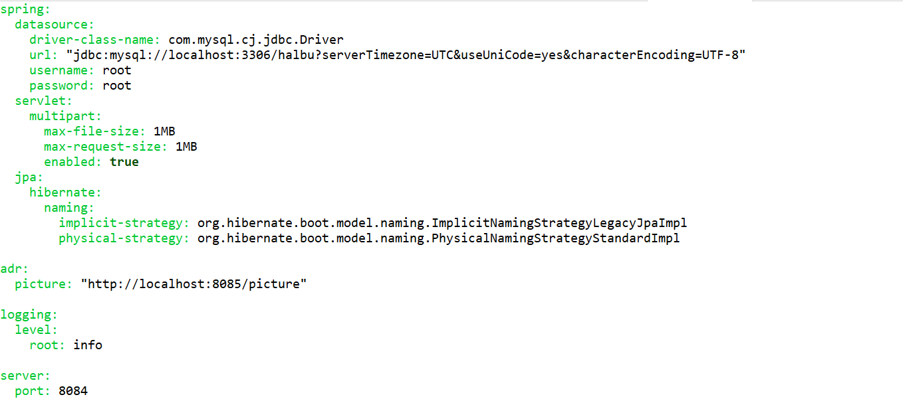
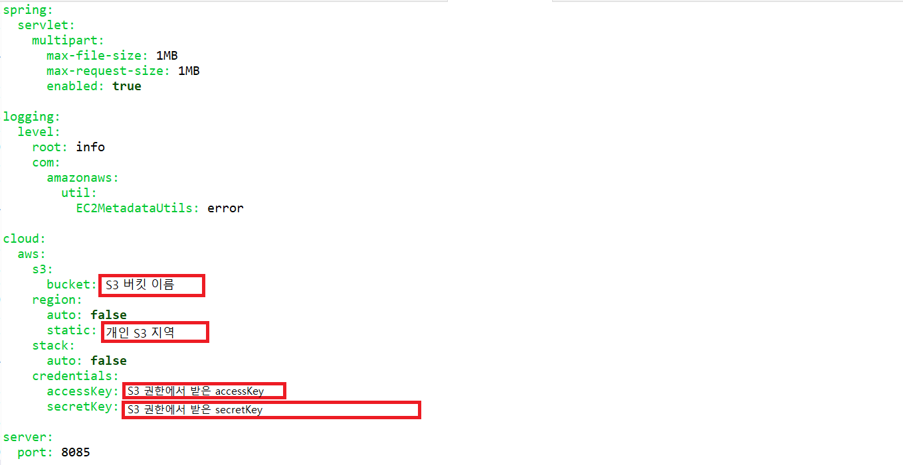
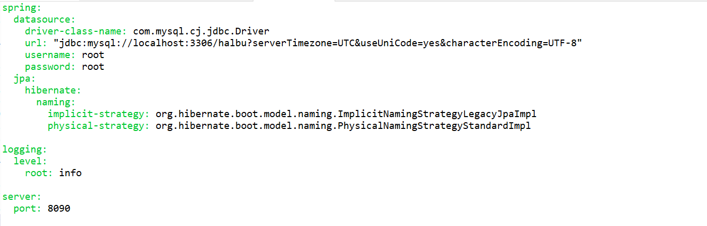

### 실행방법

https://drive.google.com/file/d/1pd7-_dGfm6C2tz51kxrIbZ3jyZVaXtoc/view?usp=sharing

구글 드라이브에서 release.zip 다운로드 후 기기 CPU에 맞는 apk 설치 후 실행

<br/>

### 환경구축

##### 1. 로컬 환경에서 실행하기 위한 코드 수정

- 구글 로그인 설정

  React Native Community 지원 패키지 인 react-native-google-signin/google-signin 사용

  1. Google API Console에서 프로젝트 생성해서, 사용자 인증 정보 만들기 클릭하여 OAuth 클라이언트 ID 만들기 
     이 때 패키지 이름을 ** android/app/src/main/AndroidManifest.xml에 작성된 package이름과 통일 시키기

  2. 발급 받은 Sha-1키  입력해서 webclientId 발급 받기

  3. android/build.gradle 수정

     ```
     buildscript {
         ext {
             buildToolsVersion = "29.0.2"
             minSdkVersion = 21
             compileSdkVersion = 29
             targetSdkVersion = 29
             googlePlayServicesAuthVersion = "17.0.0"  // 버전 16.0.0이후 사용
         }
         repositories {
             google() //포함되어 있는지 확인
             jcenter()
         }
         dependencies {
             classpath 'com.google.gms:google-services:4.3.3' // <--- 4.1.0 버전 이상 사용 
             classpath("com.android.tools.build:gradle:3.5.3") // <---3.1.2 또는 최신버전
         }
     }
     ```

  4. android/app/build.gradle 수정

     ```
     apply plugin: 'com.google.gms.google-services'
     
     dependencies {
        ...
         implementation "androidx.swiperefreshlayout:swiperefreshlayout:1.0.0" // <-이것을 추가합니다. 최신 버전도 작동
         implementation 'com.google.android.gms:play-services-auth:15.0.1' 
     }
     ```

  5. LoginScreen.js 수정

     ```
     componentDidMount 또는 useEffect에 메소드 추가
     
     GoogleSignin.configure({
       webClientId:
         "[ Google API Console에서 받은 webClientId 작성]",
       offlineAccess: true,
     });
     
     componentDidMount() {
         GoogleSignin.configure();
       }
     
     import {
       GoogleSignin,
       GoogleSigninButton,
       statusCodes,
     } from '@react-native-google-signin/google-signin'; //import하여 사용
     ```

<br/>

<br/>

- axios 주소 변경

  - screens\Home\HomeScreen.js

    ```
    const baseURL = "http://halbu.net";
    => const baseURL = "http://localhost:8084";
    ```

  - screens\Login\LoginScreen.js

    ```
    const baseURL = "http://halbu.net";
    => const baseURL = "http://localhost:8084";
    ```

  - screens\Photo\ModifyPhoto.js

    ```
    const baseURL = "http://halbu.net";
    => const baseURL = "http://localhost:8084";
    ```

  - screens\Photo\PhotoScreen.js

    ```
    const baseURL = "http://halbu.net";
    => const baseURL = "http://localhost:8084";
    ```

  - screens\Regist\Regist.js

    ```
    const baseURL = "http://halbu.net";
    => const baseURL = "http://localhost:8090"
    ```

  - App.js

    ```
    const baseURL = "http://halbu.net";
    => const baseURL = "http://localhost:8090"
    ```

<br/><br/>

- SpringBoot application.yml 파일 수정

  - phonebook

    

  <br/>

  - picture

    

  <br/>

  - emergency

    

<br/><br/>

##### 2. frontend : 프로젝트 [readme.md] Installation 참조

- run (android app)

```
cd frontend
npm i
react-native run-android
```

<br/>

- build (android app)
- apk 경로 : android/app/build/outputs/apk/release

```
cd frontend
npm i
cd android
gradlew clean
gradlew assembleRelease
```

<br/>

<br/>

##### 3. exec 폴더 내의 db import

<br/>

<br/>

##### 4. 모든 SpringBoot 서버 실행

<br/>

<br/>


[readme.md]: <https://lab.ssafy.com/s04-final/s04p31c107/blob/master/readme.md>
